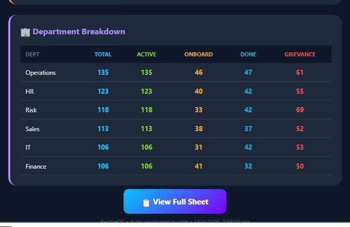
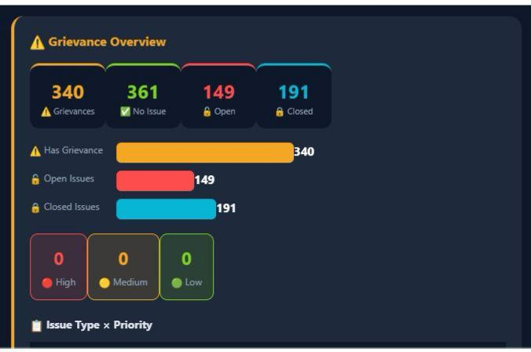
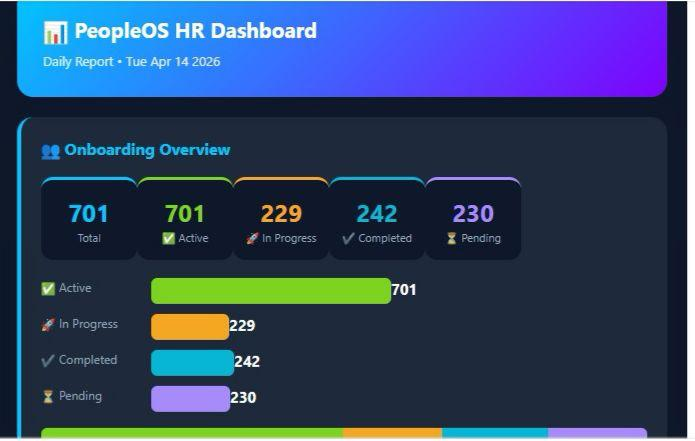
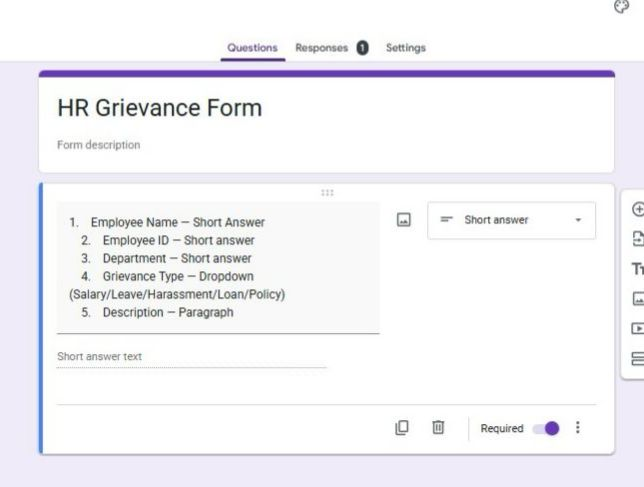
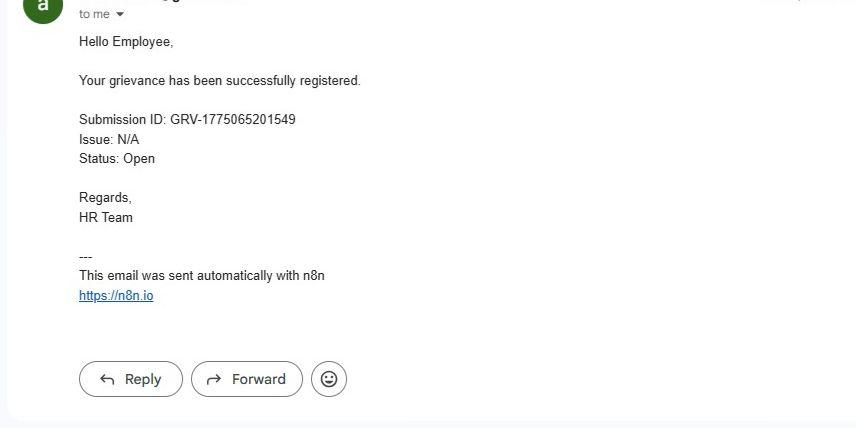
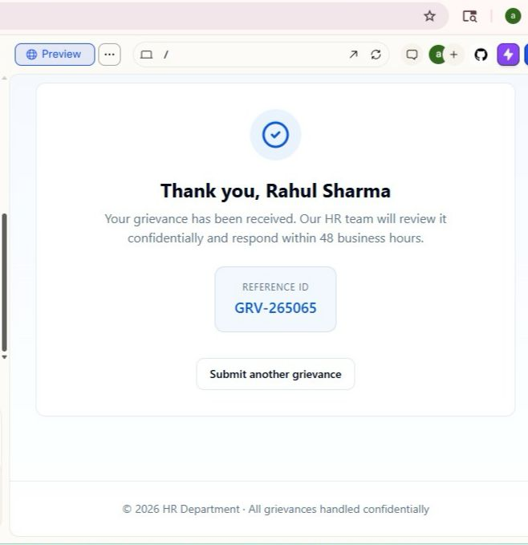
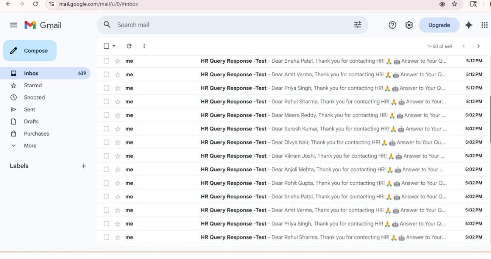
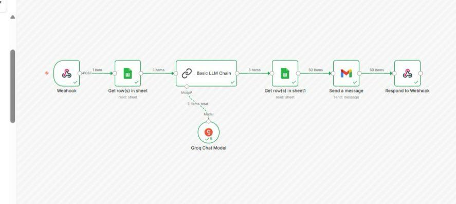
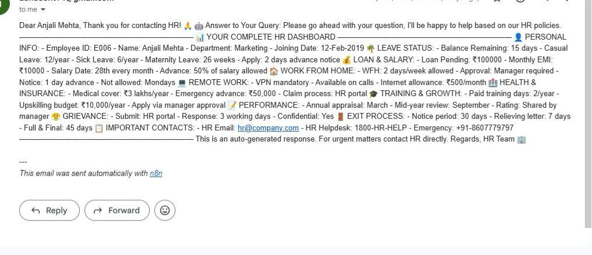

# PeopleOS — HR Automation System

Automates grievance routing, SLA tracking, and HR reporting.

---

## 📊 Dashboard

  
  

---

## ⚙️ Grievance Automation

  
  

---

## 🤖 HR Policy Bot

  
  

---

## ⚡ What it does

- Routes employee queries automatically  
- Tracks SLA without manual follow-up  
- Sends real-time notifications  
- Removes repetitive HR work  

---

## 🧠 Stack

n8n · Zapier · Groq AI · Google Sheets · Gmail
